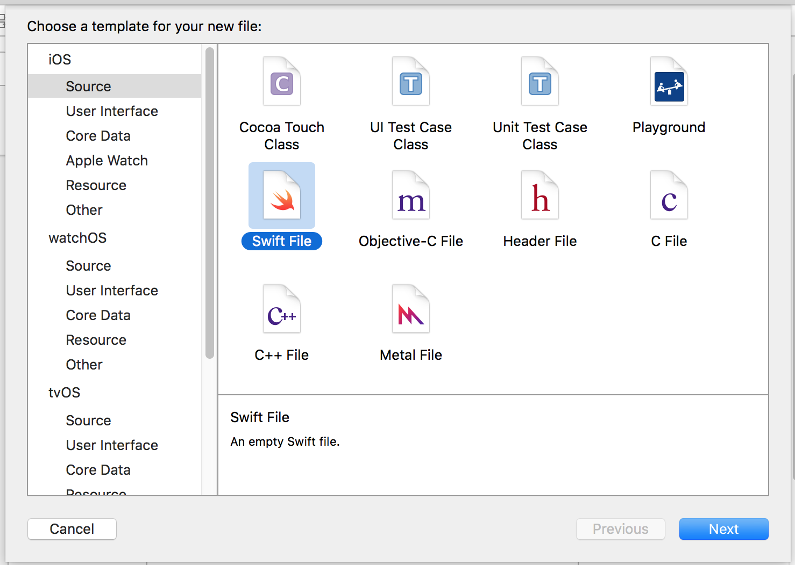
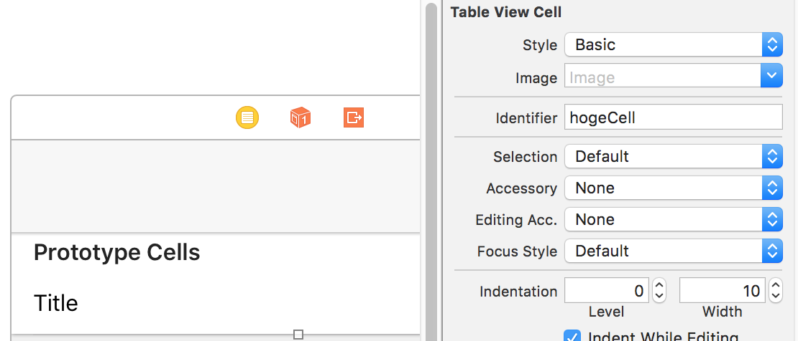

# APIサーバとの通信

ここではJSON APIサーバからデータを取得してTableViewに表示するアプリを作成します。Web開発研修でつくったAPIサーバは認証が必要になっていると思いますので、https://engineers-training.herokuapp.com/api/microposts にサンプルを用意しました。ここから返ってくるJSONの形式は、以下の通りです。配列内の要素数と、`content`の長さはランダムに変わります。

```json
{
  "data": [
    {
      "id": 1,
      "content": "ふがふがふが"
    },
    {
      "id": 2,
      "content":"ふがほげほげ"
    },
    {
      "id":3,
      "content":"ふがふがほげほげふがふがふがふがほげふが"
    }
  ]
}
```

## パッケージ管理ツールとライブラリの導入

はじめにパッケージ管理ツールの[Carthage](https://github.com/Carthage/Carthage)をインストールします。その後、それを使用して以下の2つのライブラリを導入します。

- [Alamofire](https://github.com/Alamofire/Alamofire)
- [SwiftyJSON](https://github.com/SwiftyJSON/SwiftyJSON)

Alamofireは、Foundationが提供する[`NSURLSession`](https://developer.apple.com/library/mac/documentation/Foundation/Reference/NSURLSession_class/)や[`NSHTTPURLResponse`](https://developer.apple.com/library/mac/documentation/Cocoa/Reference/Foundation/Classes/NSHTTPURLResponse_Class/)といったクラス（参考: [About the URL Loading System](https://developer.apple.com/library/ios/documentation/Cocoa/Conceptual/URLLoadingSystem/URLLoadingSystem.html)）を利用したHTTPクライアントライブラリです。後者のSwiftyJSONは、レスポンスのJSONの取り扱いを簡潔に記述するために使います。
各リポジトリのREADMEにある手順に従って、それぞれ導入してください。Carthageの他にも[CocoaPods](https://github.com/CocoaPods/CocoaPods)というツールもありますが、ここでは使用しません。

## APIClientクラスの作成

APIとの通信を担う`APIClient`クラスを作成します。今回は`Helpers`グループ以下に作成します。



以下の様に実装します。エラー処理はほぼ省略しています。

```swift
import Foundation
import Alamofire
import SwiftyJSON

class APIClient {
    static private let baseUrl = "https://engineers-training.herokuapp.com"

    static func request(endpoint: Endpoint, handler: (json: JSON) -> Void) {
        let method = endpoint.method()
        let url = fullURL(endpoint)

        Alamofire.request(method, url).validate(statusCode: 200...299).responseJSON { response in
            switch response.result {
            case .Success(let value):
                handler(json: JSON(value))
            case .Failure(let error):
                print(error)
            }
        }
    }

    static private func fullURL(endpoint: Endpoint) -> String {
        return baseUrl + endpoint.path()
    }
}

enum Endpoint {
    case HogeIndex

    func method() -> Alamofire.Method {
        switch self {
        case .HogeIndex: return .GET
        }
    }

    func path() -> String {
        switch self {
        case .HogeIndex: return "/api/microposts"
        }
    }
}
```

`Hoge`モデルを作成し、その中でAPIClientを使用します。

```swift
import Foundation

class Hoge {
    var id: Int
    var content: String

    init(id: Int, content: String) {
        self.id = id
        self.content = content
    }

    static func fetchHoges(handler: (Array<Hoge> -> Void)) {
        APIClient.request(Endpoint.HogeIndex) { json in
            let hoges = json["data"].arrayValue.map {
                Hoge(id: $0["id"].intValue, content: $0["content"].stringValue)
            }

            handler(hoges)
        }
    }
}
```

ViewController内で`fetchHoges()`を呼び出します。まずは簡単のため、`viewDidLoad`で使用します。APIサーバから取得したデータがコンソールに出力されます。

```swift
import UIKit

class ViewController: UIViewController {

    override func viewDidLoad() {
        super.viewDidLoad()

        Hoge.fetchHoges() { hoges in
            print(hoges)
        }
    }

    override func didReceiveMemoryWarning() {
        super.didReceiveMemoryWarning()
    }
}
```

## データの表示

取得したデータをTableViewに表示します。`Main.storyboard`にあるView Controllerを一旦消して、Table View Controllerに置き換えます。上部に"Prototype Cells"として、このテーブルに表示される行の雛形となるTable View Cellが表示されます。Table View Cellには、いくつかスタイルが用意されています。今回は"Basic"を選択し、Identifierに"hogeCell"を入力します。



テーブルビューは、何をどのようにテーブルに表示するか決める処理をコントローラに委譲（delegate）します。つまり設置したTable View ControllerのCustom Classに設定されるクラスには、それらを決定する処理が実装されている必要があります。`ViewController`のsuperクラスを[`UITableViewController`](https://developer.apple.com/reference/uikit/uitableviewcontroller)に変更し、Custom Classを設定します。

```swift
class ViewController: UITableViewController {
```


次に、セルにテキストを表示するためのコードを書いていきます。ここでは`tableView`という名前のメソッドをいくつかoverrideすることで挙動を記述します。それぞれのメソッドの役割は、⌘を押しながらメソッド名をクリックすると読むことができます。また、これらについては[UITableViewDataSource](https://developer.apple.com/reference/uikit/uitableviewdelegate)プロトコルと[UITableViewDelegate](https://developer.apple.com/reference/uikit/uitableviewdelegate)プロトコルのドキュメントに詳細な記述があるので、参照してください。

```swift
import UIKit

class ViewController: UITableViewController {

    var hoges = [Hoge]()

    override func viewDidLoad() {
        super.viewDidLoad()

        Hoge.fetchHoges() { hoges in
            self.hoges = hoges
            self.tableView.reloadData()
        }
    }

    override func didReceiveMemoryWarning() {
        super.didReceiveMemoryWarning()
    }

    override func tableView(tableView: UITableView, numberOfRowsInSection section: Int) -> Int {
        return self.hoges.count
    }

    override func tableView(tableView: UITableView, cellForRowAtIndexPath indexPath: NSIndexPath) -> UITableViewCell {
        let cell = self.tableView.dequeueReusableCellWithIdentifier("hogeCell", forIndexPath: indexPath)

        updateCell(cell, indexPath: indexPath)

        return cell
    }

    private func updateCell(cell: UITableViewCell, indexPath: NSIndexPath) {
        cell.textLabel?.text = self.hoges[indexPath.row].content
    }
}
```

⌘+Rで動作を確認してください。
