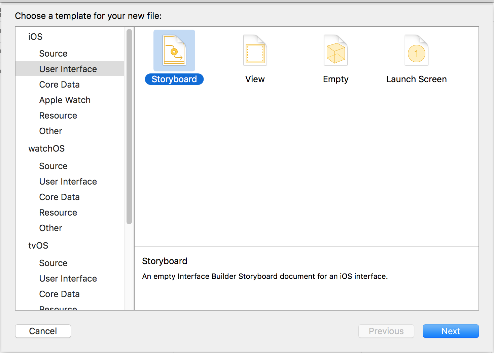
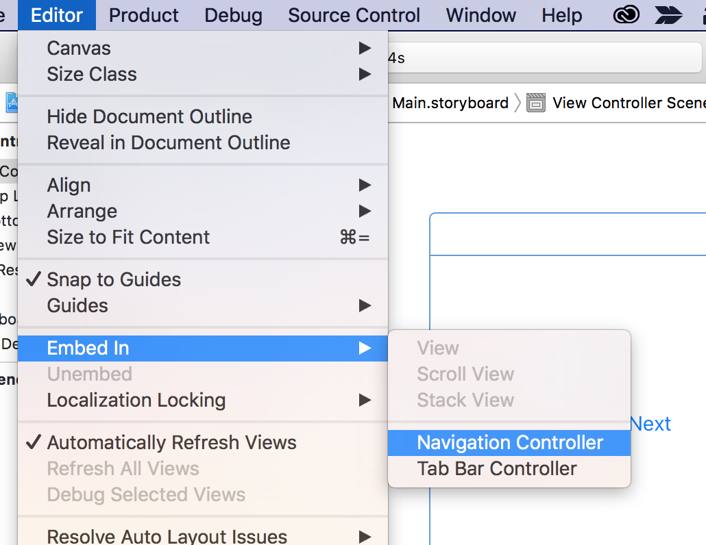
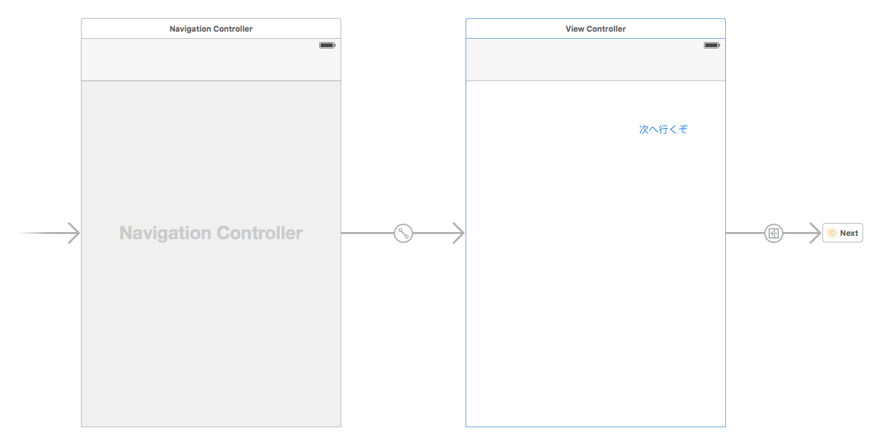
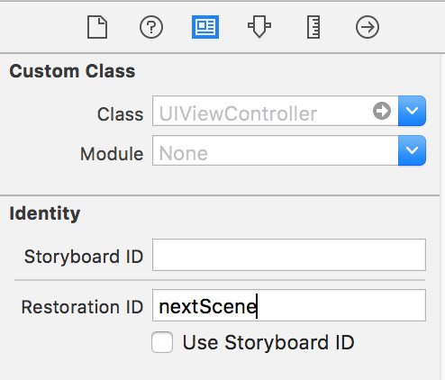

# 画面遷移

ここではアプリ内で画面を遷移する方法をいくつか試します。`Main.storyboard`と`Next.storyboard`の2つを用意し、前者から後者へ遷移するようにしていきます。

## Segueを使った遷移

### ボタンによるSegueの実行

以下、[プロジェクトの準備](./new-project.md)を行った直後という前提で進めます。まず遷移先の`Next.storyboard`を作ります。



Object LibraryからView Controllerを配置します。そこにエントリポイントを設置するため、以下のように"Is Initial View Controller"にチェックを入れます。また、遷移後にそれが`Next.storyboard`であるとわかるように、適当なラベルを置いておきます。


階層構造を持った遷移を実装するため、[Navigation Controller](https://developer.apple.com/library/ios/documentation/WindowsViews/Conceptual/ViewControllerCatalog/Chapters/NavigationControllers.html)を使用します。`Main.storyboard`のView Controllerを選択して「Editor > Embed in > Navigation Controller」から埋め込みを行います。



遷移のトリガーとなるボタンを`Main.storyboard`のView Controllerに1つ設置します。また、このボタンと遷移先のStoryboardを結びつけるため、Storyboard Referenceを横に置きます。Storyboard ReferenceのAttribute Inspectorを開き、Storyboardセレクトボックスで"Next"を選択します。Storyboardを分割した理由については以下で説明します。


Ctrlを押しながら、設置したボタンからStoryboard Referenceへドラッグし、Action SegueにShowを設定します。画面遷移の種類については後で説明します。ここまで設定すると、`Main.storyboard`は以下のようになっているはずです。



⌘+Rでアプリを起動し、動作を確認します。なお、`ViewController.swift`の`prepareForSegue`というメソッドをoverrideすることで、必要に応じて遷移する前の準備などを行うことができます。

```swift
override func prepareForSegue(segue: UIStoryboardSegue, sender: AnyObject?) {
    // Mainから遷移する前の準備
    let vc = segue.destinationViewController as! NextViewController
    vc.someAttribute = self.myAttribute
}
```

### コードによるSegueの実行

上の場合はボタンからStoryboard ReferenceへドラッグしてSegueをつくりましたが、"View Controller"から伸ばしてSegueをつくり、それをコードから実行するという方法も存在します。ユーザからの操作ではなく、通信の完了や時間の経過をトリガーにしたい場合に利用できます。


コードから実行するSegueにIDを設定します。


`viewDidLoad`の中に以下のコードを書いてアプリを起動すると、起動直後に`Next.storyboard`へ遷移します。

```swift
self.performSegueWithIdentifier("goNext", sender: nil)
```

この方法でも、上で述べた`prepareForSegue`が遷移前に呼ばれます。

### Unwind Segue

Segueによる遷移をした後、その遷移を遡って前の画面へ戻るようなSegueを[Unwind Segue](https://developer.apple.com/library/ios/technotes/tn2298/_index.html)と呼びます。戻り先の画面のView Controller、つまりここでは`ViewController.swift`に以下のようなアクションを追加します。メソッド名は任意です。

```
@IBAction func unwindToMainScreen(sender: UIStoryboardSegue) {
    print("Mainに戻ります")
}
```

次に`Next.storyboard`に適当なボタンを設置し、Ctrlを押しながらドラッグして、矢印を上部の"Exit"へ伸ばします。ポップアップに定義したメソッドが現れるので選択します。


⌘+Rで元の画面に戻れることを確認します。[コードによるSegueの実行](#コードによるSegueの実行)で書いたように、"View Controller"から"Exit"へ矢印を伸ばしてつくったSegueにIDを設定し、`performSegueWithIdentifier`を呼ぶ方法でも戻ることができます。また、条件によってはUnwindをしたくない場合もあると思われます。その際は`canPerformUnwindSegueAction`コールバックを上書きして判定します。

```swift
override func canPerformUnwindSegueAction(action: Selector, fromViewController: UIViewController, withSender sender: AnyObject) -> Bool {
    return false
}
```

## Segueを使わない遷移

Segueを使用せず、StoryboardオブジェクトからViewControllerをインスタンス化します。

```swift
@IBAction func buttonTapped(sender: AnyObject) {
    let nextStoryboard = UIStoryboard(name: "Next", bundle: nil)
    let nextViewController = nextStoryboard.instantiateViewControllerWithIdentifier("nextScene")

    self.presentViewController(nextViewController, animated: true, completion: nil)
}
```

このコードは別のStoryboardにあるView Controllerをインスタンス化するため、はじめに`UIStoryboard(name: "Next", bundle: nil)`でStoryboardをインスタンス化しています。同じStoryboard上にある場合は、`self.storyboard!.instantiateViewControllerWithIdentifier(...)`で同様のことが可能です。
`instantiateViewControllerWithIdentifier`の引数に使うIDは、Storyboardの以下から設定できます。



インスタンス化するViewControllerが、そのStoryboardのInitial View Controllerであるならば、`instantiateInitialViewController`メソッドでもインスタンスを得ることができます。この場合はIDを指定しないので、設定も必要ありません。

## 遷移の種類

iOSアプリの画面遷移にはいくつかの種類があります。
Showは、一覧画面から詳細画面など、階層構造の下の方へ遷移する場合に用いられます。上で使用した`NavigationController`は内部にView Controllerスタックを持っており、そこに新たなView Controllerがプッシュされます。Xcode 5以前は、その動作の通りPushという名称でした。一方でShow Detailは、スタックにプッシュするのではなく、スタックの一番上のView Controllerを置換します。
Present Modallyはモーダルという名前の通り、現在表示されている画面の上に重なるように新たな画面を表示します。ユーザの注意を引きたい場合に使用しますが、使い過ぎには気をつけてください。HIGにも[modality](https://developer.apple.com/ios/human-interface-guidelines/interaction/modality/)というセクションがありますので参照してください。
Present as Popoverは、吹き出しのような形でView Controllerを表示します。遷移というよりも、追加の情報を示したいときに使われます。

## Storyboardの分割

Storyboardは、1つのファイルに全ての画面を詰め込むことも可能です。ただしその場合、画面数が増えれば管理しづらくなることは容易に想像できます。特に、複数人で作業しているときにStoryboardにコンフリクトが生じると、それを解消することは非常に困難です。それを防ぐため、画面ごとにファイルを分けてStoryboard Referenceで紐付け、同時に複数人が同じStoryboardを編集しないようにします。
