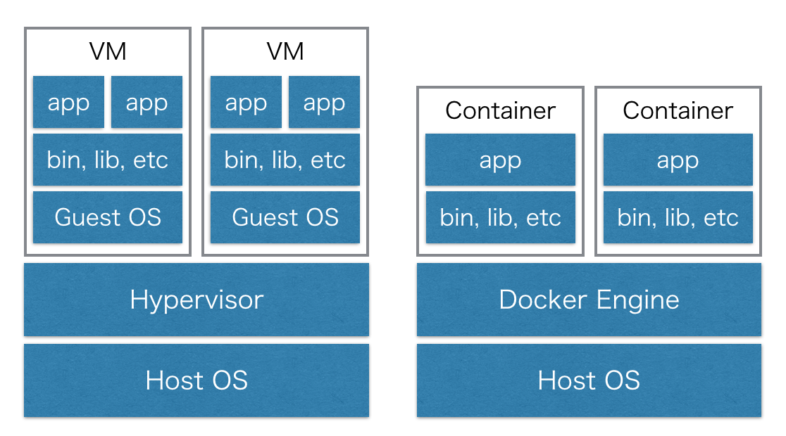

# DockerとPuppet

研修を始めるにあたって、まずはDocker(docker-compose)とPuppetの基本的な使い方を学んでいきます。

## Docker

先ほども書きましたが、Dockerはコンテナ型仮想化エンジンです。Dockerを用いると、隔離された環境でプロセスを動かすことができます。
「軽量VMとしての側面も持つ」と書きましたが、一般的に仮想マシンと呼ばれるものでは、ホストOSの上で仮想マシンを動かすためのハイパーバイザと呼ばれるソフトウェアが動き、その上でゲストOSが動き、更にその上でアプリケーションが動きます。一方でコンテナ型の仮想化エンジンであるDockerは、Dockerエンジンの上に、1つのプロセスが走るための隔離された空間を切ります。この空間をコンテナと呼びます。ホストOSと各コンテナではカーネルが共有されるため、ゲストOSのセットアップなどが必要ありません。そのため、仮想マシンに比べて高速に起動できます。アーキテクチャについてより詳しく知りたい場合は、[公式の解説](http://www.docker.com/what-docker)や各種資料を参照してください。



### Docker for Macのインストール

DockerはLinuxコンテナという技術をベースとしています。Macでは直接Linuxコンテナを使えないため、Dockerコンテナを立ち上げることができませんが、[Docker for Mac](https://docs.docker.com/docker-for-mac/)をインストールすることでこれが可能となります。Docker for Macを導入すると、[Docker Engine](https://docs.docker.com/engine/userguide/intro/)、[Docker Compose](https://docs.docker.com/compose/overview/)、[Docker Machine](https://docs.docker.com/machine/overview/)と、それらを扱うためのCLIがインストールされます。
Docker for Macが登場する前は、boot2dockerというツールや、Docker MachineでVirtualBoxの上にDockerホストを用意して、その上にコンテナをつくる方法が採られていました。2016年7月時点では、今後はDocker for Macがデファクトになると見られています。

### Dockerコンテナ

適当な作業用ディレクトリを切り、`Dockerfile`という名前のファイルを作ります。
`Dockerfile`には、Dockerイメージを構築する手順を記述します。

```dockerfile
# Dockerfile

FROM joenoh/puppet:latest
MAINTAINER Joe Honzawa <honzawa.j@pepabo.com>

RUN apt-get update
```

最初に、`FROM`でベースとするイメージを指定する必要があります。今回は、簡単にPuppetを試すため[Dockerhub](https://hub.docker.com)に[joenoh/puppet](https://hub.docker.com/r/joenoh/puppet/)イメージを用意しましたので、これを使います。Dockerhubは、DockerイメージのGitHubのようなもので、多くのイメージが公開されています。joe-noh/puppetのDockerfileもまた公開されており、上の内容と以下はほぼ等価です。

```dockerfile
FROM ubuntu:16.04
MAINTAINER Joe Honzawa <honzawa.j@pepabo.com>

RUN apt-get update \
  && apt-get install -yqq --no-install-recommends puppet=3.8.5-2 ruby=1:2.3.0+1 \
  && apt-get clean \
  && rm -rf /var/lib/apt/lists/*
RUN gem install bundler --no-document

RUN apt-get update
```

Dockerfileができたら、Dockerイメージを作ります。できたイメージは`docker images`コマンドで確認できます。

```
$ docker build .

... 中略

Successfully built 160e73e988cc

$ docker images
REPOSITORY          TAG           IMAGE ID            CREATED             SIZE
<none>              <none>        160e73e988cc        4 minutes ago       195.2 MB
```

イメージが作られていることが確認できたら、イメージIDを指定してコンテナを起動します。`-it`オプションは、今はコンテナ内で操作を行うためのオプションと覚えておいてください。

```
$ docker run -it 160e73e988cc
[root@48e03e13ca26 /]#
```

### Docker Compose

Docker Composeは、複数のコンテナからなる系の定義や起動を行うためのツールです。依存関係にあるコンテナを順番に起動したり、まとめてコンテナを止めることなどができます。
Docker Composeでは`docker-compose.yml`というファイルに定義を記述します。以下の内容ならば、`web001`、`bastion`という名前のコンテナが立ち上がります。コンテナの中ではinitプロセスが起動し、ホストであるMacの8080番ポートが`web001`の80番に、2222番が`bastion`の22番にそれぞれマッピングされます。

```yml
# docker-compose.yml

version: '2'
services:
  web001:
    build: .
    command: /sbin/init
    privileged: true
    hostname: web001
    container_name: web001
    ports:
      - '8080:80'
  bastion:
    build: .
    command: /sbin/init
    privileged: true
    hostname: bastion
    container_name: bastion
    ports:
      - '2222:22'
```

```
$ docker-compose up -d

... 中略

$ docker-compose ps
 Name      Command     State          Ports
---------------------------------------------------
bastion   /sbin/init   Up      0.0.0.0:2222->22/tcp
web001    /sbin/init   Up      0.0.0.0:8080->80/tcp
```

立ち上がったコンテナには、コンテナ名を指定して、以下のコマンドで入ることができます。

```
$ docker exec -it web001 /bin/bash
```

## Puppet

サーバがどのような状態にあるべきかを記述したものを、Puppetではマニフェストと呼びます。Puppetにおいて、マニフェストを適用する方法は2つあります。localhostに置いてあるマニフェストをlocalhostに適用するやり方、つまり1台で完結する方法をStandaloneモードと呼び、各サーバがマニフェストを持った1台からカタログ（マニフェストをコンパイルしたもの）を取得して適用する方法をAgent/Masterモード（または Client/Serverモード）と呼びます。ここではStandaloneモードから始めて、その後Agent/Masterモードを試します。
各モードの詳細は、[Puppetのドキュメント](https://docs.puppet.com/puppet/latest/reference/architecture.html)を参照してください。

### Standalone

`manifests`ディレクトリを切り、最初のマニフェスト`site.pp`をつくります。

```puppet
# manifests/site.pp

notify {'hello':
  message => 'hello, puppet!'
}
```

[notifyリソース](https://docs.puppet.com/puppet/latest/reference/type.html#notify)を使い、メッセージを出力するだけのマニフェストです。Dockerコンテナの中に設置する必要があるので、Dockerfileを以下のように編集します。

```dockerfile
# Dockerfile

FROM joenoh/puppet:latest
MAINTAINER Joe Honzawa <honzawa.j@pepabo.com>

RUN apt-get update

ADD . /etc/puppet
```

この`ADD`によって、このディレクトリの内容がコンテナの`/etc/puppet`以下にコピーされます。コピーする必要がないものは`.dockerignore`というファイル内で指定します。

```dockerignore
# .dockerignore

docker-compose.yml
Dockerfile
.DS_Store
.git
```

今起動しているコンテナは古いDockerfileから作られたものなので、コンテナを立て直します。その後、`/etc/puppet`以下にマニフェストが配置されていることを確認します。

```
$ docker-compose up -d --build
$ docker exec web001 cat /etc/puppet/manifests/site.pp
notify {'hello':
  message => 'hello, puppet!'
}
```

マニフェストを適用してみます。以下の様な出力が得られれば成功です。

```
$ docker exec web001 puppet apply /etc/puppet/manifests/site.pp
Notice: Compiled catalog for localhost.local in environment production in 0.01 seconds
Notice: hello, puppet!
Notice: /Stage[main]/Main/Notify[hello]/message: defined 'message' as 'hello, puppet!'
Notice: Finished catalog run in 0.02 seconds
```

#### Puppet Module

マニフェストをStandaloneモードで適用できましたが、単にhelloと出力するだけでは実用性がありませんので、次はNginxをインストールします。Puppetではマニフェストを再利用可能にするためにモジュールという仕組みがあり、Nginxのインストールや設定を行うモジュールがつくられているので、それを利用します。モジュールは[Puppet Forge](https://forge.puppet.com)から取得することができますが、一般的に[librarian-puppet](https://github.com/voxpupuli/librarian-puppet)を使って管理します。Rubyで例えると、モジュールはgem、Puppet ForgeはRubygems、librarian-puppetはbundlerに相当します。

librarian-puppetはRubyのgemとして入手できるので、まずはGemfileを作ります。

```ruby
# Gemfile

source 'https://rubygems.org'

gem 'librarian-puppet'
```

その後、librarian-puppetで管理するモジュールをPuppetfileというファイルに記述します。今回はnginxのインストールに[jfryman-nginx](https://forge.puppet.com/jfryman/nginx)を使います。

```ruby
# Puppetfile

forge 'https://forgeapi.puppetlabs.com'

mod 'jfryman-nginx'
```

`librarian-puppet install`を実行し、Puppetfile.lockを作成してください。これはGemfile.lockのように、Puppet Moduleのバージョン管理を行い、開発環境と運用環境で同じPuppet Moduleを使うことを保証します。`modules`が生成されるので、これを`.dockerignore`に追加します。

Dockerコンテナ内で`bundle install`等を行いたいので、Dockerfileに追記します。

```dockerfile
# Dockerfile

FROM joenoh/puppet:latest
MAINTAINER Joe Honzawa <honzawa.j@pepabo.com>

RUN apt-get update

ADD . /etc/puppet

WORKDIR /etc/puppet
RUN bundle install
RUN bundle exec librarian-puppet install
```

ここまでで、jfryman-nginxモジュールを使う準備ができたので、どのように使用するかを見ていきます。
モジュールには一般的に1つ以上のクラスが含まれます。Puppetにおけるクラスは、プログラミングにおける関数のような存在です。引数を取り、ある1つのことを行います。jfryman-nginxモジュールは`nginx`クラスを提供しており、以下のように使うことでNginxのインストールと起動を行うことができます。

```puppet
# 引数を取る場合の書き方
class {'nginx':
  manage_repo => true,
  package_source => 'nginx-stable'
}

# 引数を取らない場合の書き方
# 引数の一部はデフォルト値が設定されている
class {'nginx': }

# 引数を取らない場合は以下の書き方でもよい
# :: によってトップレベルスコープのnginxクラスを指定している
include ::nginx
```

`nginx`クラスは単にNginxのインストールと起動をするだけなので、追加の設定はjfryman-nginxモジュールが定義した[リソース](https://docs.puppet.com/puppet/latest/reference/lang_defined_types.html)を使用して行います。ここでは`nginx::resource::vhost`を使ってドキュメントルートを設定します。同時に、[fileリソース](https://docs.puppet.com/puppet/latest/reference/types/file.html)でそこに置くHTMLファイルを作ります。

```puppet
# manifests/site.pp

# jfryman-nginxが用意したクラスを利用する
include ::nginx

# /var/www/htmlをドキュメントルートに設定する
# これの前に必要な物をrequireで指定する
nginx::resource::vhost {'set www root':
  www_root => '/var/www/html',
  require  => [Package['nginx'], Class['Nginx::Config']],
}

# /var/www/html/index.htmlを配置するためにディレクトリを用意する
# $dirs のように変数を使用できる
$dirs = ['/var/www', '/var/www/html']
file { $dirs:
  ensure => directory,
}

# /var/www/html/index.htmlを配置する
file {'/var/www/html/index.html':
  ensure  => file,
  content => '<h1>Hello from Docker Container</h1>',
}
```

クラスとリソースは、どちらも幾つかの引数をとり、特定の処理を行うものです。最も大きな違いは、クラスは複数回使うことができないという点です。使い分けの目安は、Nginxをインストールする等のある程度まとまった処理はクラスで書き、`file`や`user`のように何度か使用したいものや、リソースとしてモデリングしたほうが自然である場合はリソースとして定義するのがよいでしょう。

ではNginxをインストールするため、コンテナを立てなおして、マニフェストを適用します。

```
$ docker-compose up -d --build
$ docker exec web001 puppet apply /etc/puppet/manifests/site.pp
```

`web001`の80番ポートはホストの8080番からアクセスできるように設定してあるので、[http://localhost:8080](http://localhost:8080)をブラウザで開いて、"Hello from Docker Container"が表示されればNginxが正常に動いています。

### Agent/Master

この研修では主にStandaloneモードで進めていきますが、Agent/Masterモードも触っておきます。

#### コンテナの準備

AgentとMasterでセットアップの方法が異なるため、Dockerfileも2つ用意します。Agentにはマニフェストを置かないので、Dockerfileはほぼ空です。Masterには[joenoh/puppetmaster](https://hub.docker.com/r/joenoh/puppet/)というイメージを使用します。このイメージはrubyとpuppetmasterをインストールし、`puppetmaster`サービスの起動を行います。`Dockerfile-master`ではそれに加えて、マニフェストの配置とPuppetモジュールのインストールを行います。

```dockerfile
# Dockerfile-agent

FROM joenoh/puppet
MAINTAINER Joe Honzawa <honzawa.j@pepabo.com>

RUN apt-get update
```

```dockerfile
# Dockerfile-master

FROM joenoh/puppetmaster
MAINTAINER Joe Honzawa <honzawa.j@pepabo.com>

RUN apt-get update

ADD . /etc/puppet

WORKDIR /etc/puppet
RUN bundle install
RUN bundle exec librarian-puppet install
```

docker-compose.ymlはこれまでとほぼ同じです。

```yaml
version: '2'
services:
  web001:
    build:
      context: .
      dockerfile: Dockerfile-agent
    command: /sbin/init
    privileged: true
    hostname: web001
    container_name: web001
    ports:
      - '8080:80'
  pmaster:
    build:
      context: .
      dockerfile: Dockerfile-master
    command: /sbin/init
    privileged: true
    hostname: pmaster
    container_name: pmaster
```

適用するマニフェストは、これまでと同じNginxのインストールを行うものです。ただし、どのホストにどのマニフェストが適用されるかを、`node`を使って指定します。

```puppet
# manifests/site.pp

node 'web001.local' {
  include ::nginx

  nginx::resource::vhost {'set www root':
    www_root => '/var/www/html',
    require  => [Package['nginx'], Class['Nginx::Config']],
  }

  $dirs = ['/var/www', '/var/www/html']
  file { $dirs:
    ensure => directory,
  }

  file {'/var/www/html/index.html':
    ensure  => file,
    content => '<h1>Hello from Docker Container</h1>',
  }
}
```

AgentはMasterをFQDNで名前解決できる必要があります。ここでは少し手間ではありますが、MasterホストのIPアドレスをAgentの`/etc/hosts`に追記します。FQDNは`pmaster.local`となります。Nyahの上に構築する場合、このようなPuppetを使うための前準備は[cloud-init](http://cloudinit.readthedocs.io/en/latest/)などを使って行います。

```
$ docker inspect pmaster | grep IPAddress
            "SecondaryIPAddresses": null,
            "IPAddress": "",
                    "IPAddress": "172.23.0.3",
$ docker exec -it web001 /bin/bash
# apt-get install vim-nox
# vim /etc/hosts  # 172.23.0.3  pmaster.local  を追記
# ping pmaster.local  # 疎通を確認
# exit
```

#### マニフェストの適用

ここまで準備ができたら、Masterからカタログを取得するためAgentで以下のように`puppet agent`コマンドを実行します。`--server`オプションでMasterを指定します。`--test`は、1度だけマニフェストの適用を試すときに用いられます。実体は複数のオプションをまとめて指定するエイリアスです。

```
$ docker exec web001 puppet agent --test --server pmaster.local
```

初回は証明書が無いというエラーが出て失敗します。PuppetのAgentとMasterの間の通信は全てSSLで暗号化されて行われます。このときに使用するサーバ証明書をつくるため、AgentからMasterへ署名要求（CSR）が送られています。`puppet cert`コマンドでMasterによる署名を行ったあと、再度Agentからカタログを要求します。詳細なステップは[公式のドキュメント]を参照してください。なお、この署名を自動で行うようする[autosign](https://docs.puppet.com/puppet/latest/reference/ssl_autosign.html)という仕組みも存在します。その場合、信頼できるホストのみが署名要求を行えるように、ネットワークを隔離するなどの工夫が必要です。

```
$ docker exec pmaster puppet cert --list
$ docker exec pmaster puppet cert sign web001.local
$ docker exec web001 puppet agent --test --server pmaster.local
```

[http://localhost:8080](http://localhost:8080)で前と同じHTMLが見えれば成功です。`Skipping run of Puppet configuration client`といったメッセージが出た場合は、`puppet agent --enable`を行ってから再度カタログ要求を行ってください。

### Puppetの文法

ここまでNginxをインストールするマニフェストを書いてきましたが、`->`、`~>`、`<| |>`など、カバーできていないPuppetの文法がいくつも存在します。言語としての概要を把握するには、公式の[Visual Index](https://docs.puppet.com/puppet/latest/reference/lang_visual_index.html)というページが役に立ちます。コンパクトにまとまっているので、目を通すだけならば時間もかからないと思います。
