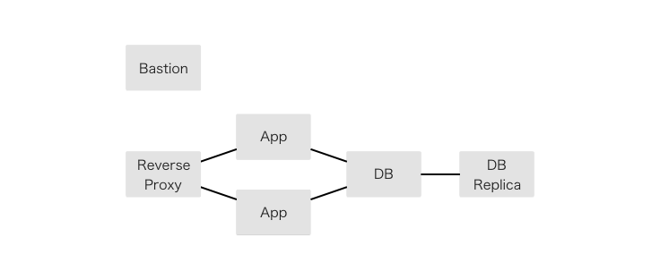

# 冗長構成

今の構成ではApp、DBはそれぞれ1台ずつですが、耐障害性を持ったシステムとするために、もう1台ずつ増やして冗長構成とします。最初にAppを2台とし、次にDBをMaster/Slave構成とします。

## 手順

### Appの冗長化

#### テストとマニフェストの追加

Railsアプリを2台に増やした構成をPuppetマニフェストに記述してください。いくつかテストするべき項目が増えると思われますので、必要なテストを追加してください。Railsアプリの動作が確認できたら、片方を終了させてもサービスが停止しないことを確かめてください。

### DBの冗長化

#### テストとマニフェストの追加

Master/Slave構成にするために必要な操作を洗い出し、マニフェスト化してください。それに伴って必要なテストを追加し、コンテナにマニフェストを適用してください。なお、この工程では、マニフェストに落とし込むことが難しいコマンド操作が多くなると思われます。全てがコードで表現され、自動化されていることが望ましいですが、実際のサービスのライフサイクルを考えれば頻繁にMaster/Slave構成を組むことはありませんので、ある程度の手作業は許容されます。

### ベンチマーク

3回目のベンチマークを取ってください。これまでの計測値を比較し、最初の構成からどのように数値が変化したか見てみましょう。

### Nyahへ

最終的な6台の構成で、Nyah上で動作させてください。
