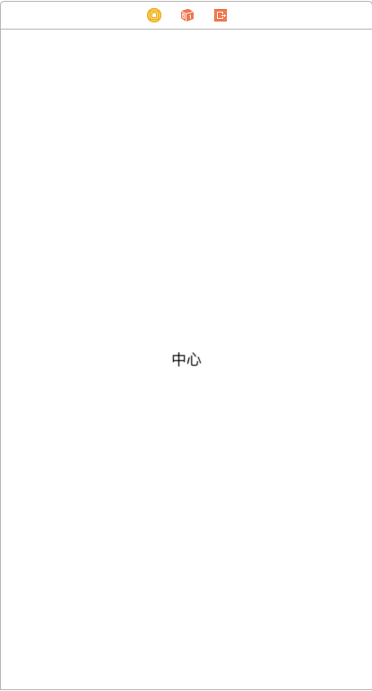
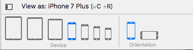
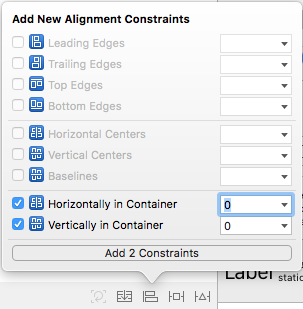
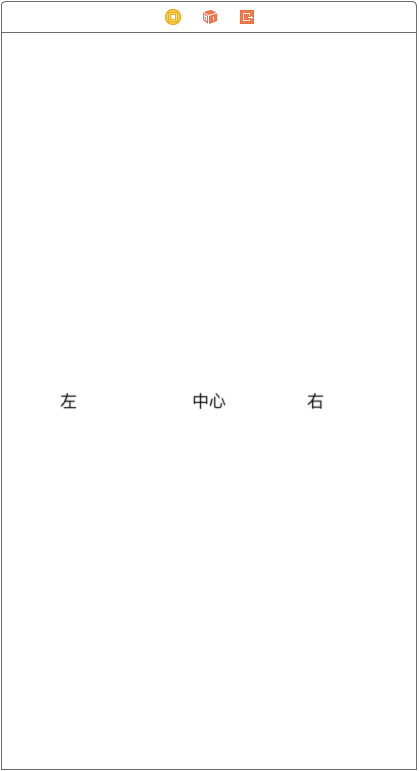
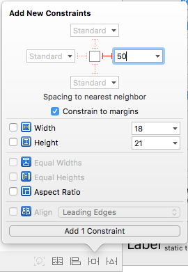
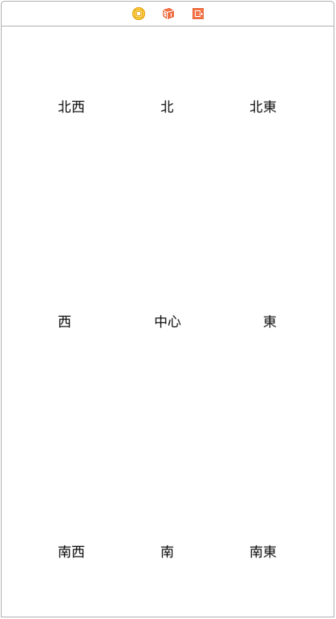

# Auto Layout

ここでは、画面にボタンなどの要素を配置する際に用いる[AutoLayout](https://developer.apple.com/jp/documentation/UserExperience/Conceptual/AutolayoutPG/index.html)について学びます。

Auto Layoutでは、各要素のサイズや要素間に制約を設けることで描画位置を動的に計算できるようにしていきます。
これにより、様々な画面サイズでウィンドウの拡大やアプリケーションの内容が変化した時に表示が崩れるのを防げます。

## 基礎練習

Auto Layout を使って要素を設置してみましょう。
事前準備として、新規プロジェクトを作成し、`Main.storyboard`を開きます。

### センタリング

Labelを設置し、テキストを中心とします。

`Devices configulation pane`からデバイスを切り替えて、画面サイズによって文字がズレることを確認します。

右下の`Add Aligment`をクリックし、水平、垂直の制約を追加します。

再度`Devices configulation pane`からデバイスを切り替えて、センタリングされていることを確認します。

### 左右対称

Labelを左右適当な位置に設置します。それぞれ、右、左とします。

右を選択し、`Add New Constraints`を選択し、右にマージン50を設定します。左は左にマージンをとります。

本題とは逸れるのですが、以下の画像では`Constrain to margins` にチェックが入っています。
これはデバイスのサイズに応じたマージンを確保しているもので、Apple推奨のデフォルト設定になっています。ビュー自体のバックグラウンドの色を変えるとマージンの存在が確認できますので、覚えておくとよいです。

両方とも垂直の制約を追加します。

## 応用練習

基礎練習が完了したら以下の配置も試してみましょう。

## まとめ

練習問題では簡単な制約を付ける練習に留まりましたが、Auto Layoutはアスペクト比の固定、他のViewに位置や大きさを揃える機能などもあります。
また、制約を追加しすぎると思わぬ挙動をとったり、デザインの自由度が低下する場合があります。なるべくシンプルな設定にすることでより管理がしやすくなり、より柔軟なレイアウトを構築できるようになります。
それらを念頭に置きながら、アプリの設計を行なってみましょう。
