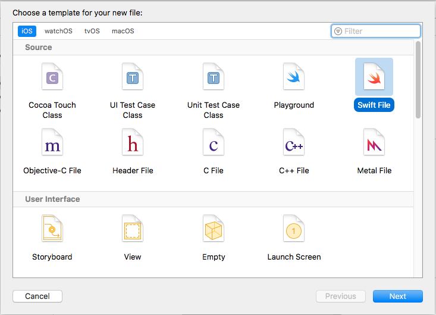
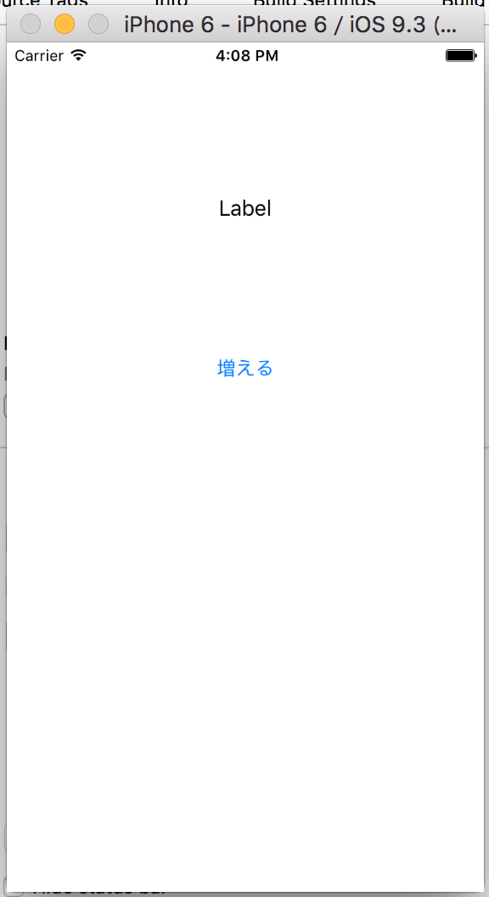
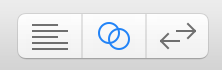
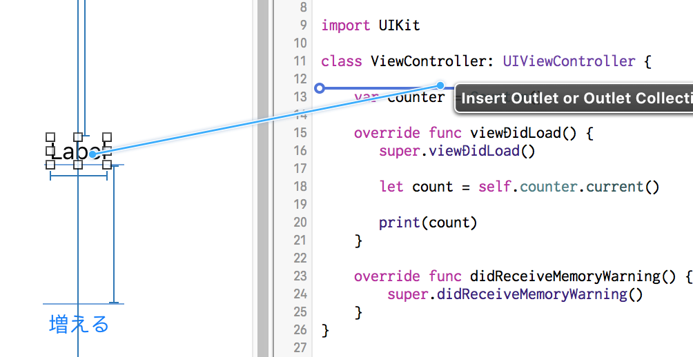
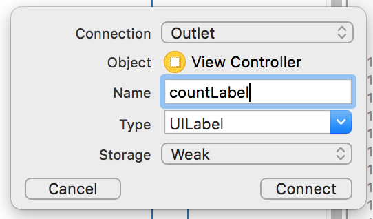
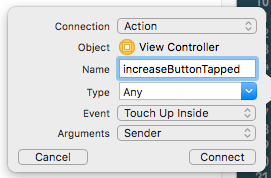

# カウンターアプリの作成

[プロジェクトの準備](./new-project.md)ができたら、簡単なカウンターアプリをつくっていきます。
この研修では[MVCアーキテクチャ](https://developer.apple.com/library/ios/documentation/General/Conceptual/DevPedia-CocoaCore/MVC.html)に則ったiOSアプリを開発していきます。一般的に、iOSにおけるMVCアーキテクチャではViewControllerが肥大化しやすいとされています。その解決策として、MVP、MVVM、VIPERといったアーキテクチャが考案されていますが、社内での採用状況や初めてiOSアプリを開発することを考慮して、MVCを選択しています。
また、[Foundation](https://developer.apple.com/reference/foundation)や[UIKit](https://developer.apple.com/reference/uikit)といったフレームワークもiOSアプリ開発において重要です。Foundationは、アプリケーション開発をサポートする汎用的なクラス（`NS`で始まるものなど）を提供するObjective-Cのライブラリです。文字列や時間、OSのサービス、ネットワークまで、広い範囲をカバーしています。一方UIKitは、アプリケーションのインターフェースを構築するためのGUIフレームワークです。タッチイベントのハンドリングやアニメーションの機能も提供しています。これらの詳細は[APIリファレンス](https://developer.apple.com/reference#app-frameworks)を参照してください。

## Modelの作成

アプリケーションのロジックは原則的にモデルに書くので、`Models/Counter`クラスをつくります。`Model` Group内にSwiftのファイルを作成します。



コードは以下を書きます。コンストラクタ、1つカウントするメソッド、現在のカウントを取得するメソッドを含むクラスです。

```swift
import Foundation

class Counter {
    private var count: Int

    init() {
        self.count = 0
    }

    func countUp() {
        self.count += 1
    }

    func current() -> Int {
        return self.count
    }
}
```

## Controllerの作成

プロジェクト作成時につくられる`ViewController`を編集します。クラス属性として、カウンターを持たせます。`viewDidLoad`は、このViewControllerが初めてインスタンス化されたときに一度だけ呼ばれるメソッドです。ライフサイクルの詳細は[UIViewControllerのドキュメント](https://developer.apple.com/library/ios/documentation/UIKit/Reference/UIViewController_Class/index.html)などを参照してください。

```swift
import UIKit

class ViewController: UIViewController {

    var counter = Counter()

    override func viewDidLoad() {
        super.viewDidLoad()

        let count = self.counter.current()

        print(count)
    }

    override func didReceiveMemoryWarning() {
        super.didReceiveMemoryWarning()
    }
}
```

## 画面の作成

ViewControllerとStoryboardを関連付けるため、`Main.storyboard`を編集します。ButtonとLabelを1つずつ置きます。AutoLayoutで以下のように中央に揃えてください。



### ViewControllerとの関連付け

`Option` + `ViewController.swift`をクリックすることで、右側にViewControllerクラスが表示されます。
また、Xcodeの右上からAssistant editorを表示し、`Main.storyboard`と`ViewController.swift`を同時に開くこともできますが、前者の方が確実に該当ファイルを開けるのでオススメです。



Ctrlを押しながら、LabelからViewControllerへ下図のようにドラッグします。



ポップアップが表示されるので、変数名を入力します。



Buttonにも同様の操作を行いますが、Buttonの場合はOutletではなくActionを選択します。



### タップイベントの処理

ButtonがタップされるたびにLabelの数値が増えていくようにします。始めに`viewDidLoad`で初期値を設定します。Buttonがタップされると`increaseButtonTapped`メソッドが呼ばれるので、その中でカウントを増やしてLabelのテキストを更新します。

```swift
import UIKit

class ViewController: UIViewController {

    @IBOutlet weak var countLabel: UILabel!

    @IBAction func increaseButtonTapped(_ sender: Any) {
        self.counter.countUp()
        self.countLabel.text = String(self.counter.current())
    }

    var counter = Counter()

    override func viewDidLoad() {
        super.viewDidLoad()

        self.countLabel.text = String(self.counter.current())
    }

    ...
}
```

⌘+Rでシミュレータを起動し、ボタンをタップして動作を確認してください。
