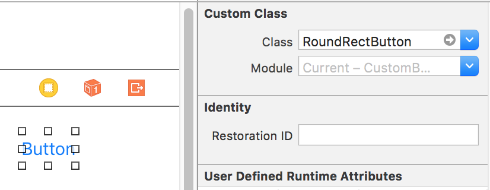
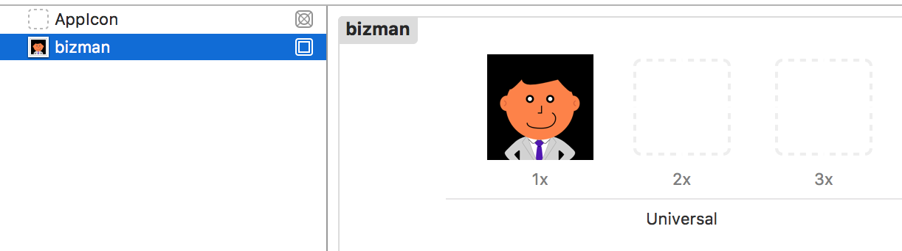
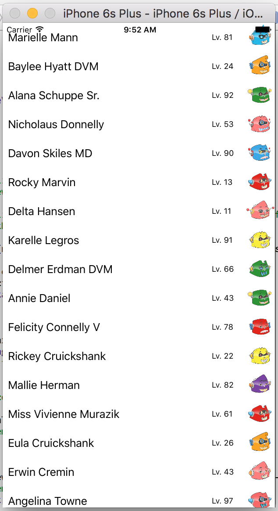

# カスタムView

UIKitによって提供されているボタンやテーブルには、デフォルトのスタイルやレイアウトが適用されています。[APIサーバとの通信](./json-api.md#データの表示)で使ったような基本的なレイアウトはいくつか用意されていますが、実際にプロダクトをつくっていくためには、これらの表示を自由に設定する方法を知っておく必要があります。ここではボタンの見た目と、テーブルセルのレイアウトをカスタマイズする方法を見ていきます。カスタマイズを行うためには、UIKitの仕様を把握することが非常に大切です。より深く知りたい場合は[UIKitのAPIリファレンス](https://developer.apple.com/reference/uikit)を参照してください。

## カスタムボタン

これまで何度かボタンを設置してきましたが、それらは白地に青い文字でした。ここではその背景を青くして文字を白にし、さらに角を丸くします。まずは[プロジェクトの準備](./new-project.md)に沿ってプロジェクトを作成してください。
次に`RoundRectButton`クラスをつくります。Cocoa Touch Classを選択し、`UIButton`を親クラスとする`RoundRectButton.swift`をViewsグループ以下に作成してください。


`UIButton`クラスを継承しているため、ボタンとして振る舞うための実装は既に揃っています。ここではコンストラクタのみを上書きし、カスタマイズされたボタンをつくります。

```swift
import UIKit

class RoundRectButton: UIButton {

    required init?(coder aDecoder: NSCoder) {
        super.init(coder: aDecoder)

        self.layer.cornerRadius = 5
        self.backgroundColor = UIColor(red: 0.0, green: 0.478, blue: 1.0, alpha: 1.0)
        self.setTitleColor(UIColor.white, for: .normal)
    }
}
```

`Main.storyboard`にButtonを置き、Custom Classに`RoundRectButton`を設定します。



⌘+Rで角丸の青いボタンが表示されていることを確認します。

### ストーリーボードでの設定と確認

ここまではコードによってボタンの色などを設定しましたが、`@IBInspectable`属性を使用することで、これらの値をStoryboard上で指定することができるようになります。また、`@IBDesignable`属性を用いることで、その変更をプレビューすることが可能となります。角の丸さや色の調整のために何度もビルドして確認するより手間が掛かりません。

```swift
import UIKit

@IBDesignable
class RoundRectButton: UIButton {
    @IBInspectable var cornerRadius: CGFloat = 0 {
        didSet {
            self.layer.cornerRadius = cornerRadius
        }
    }

    @IBInspectable var buttonColor: UIColor = UIColor.white {
        didSet {
            self.backgroundColor = buttonColor
        }
    }

    @IBInspectable var textColor: UIColor = UIColor.white {
        didSet {
            self.setTitleColor(textColor, for: .normal)
        }
    }
}
```


ここまでできたら、[カウンターアプリの作成](./counter-app.md)でつくったアプリの「増える」ボタンを自由にカスタマイズしてみましょう。

## カスタムテーブルセル

TableViewは、iOS開発において非常によく使うコンポーネントの1つです。[APIサーバとの通信](./json-api.md#データの表示)でも使用しましたが、そのときはデフォルトで用意されているレイアウトを使いました。ここではラベルや画像をどのようにセル内に配置するかをXIBファイルを使ってカスタマイズしていきます。なお、NIBという形式も存在しますが、XIBはNIBを1つのXMLファイルにまとめた新しい形式です。GitなどからするとNIBはディレクトリに見えるという違いはありますが、XIBもビルド時にはNIBへと変換されますので、基本的には同じものと考えておいてよいでしょう。

まずは[プロジェクトの準備](./new-project.md)に沿ってプロジェクトを作成します。Controllersグループ以下に、`UITableViewController`を継承した`MyTableViewController`を作成します。`Main.storyboard`にはTable View Controllerを設置し、Custom Classに`MyTableViewController`を設定してください。さらに、セルをカスタマイズするため、Viewsグループ以下に`MyTableViewCell.swift`を作成します。"New File"からSource > Cocoa Touch Class を選択し、`UITableViewCell`を親クラスとして選択します。"Also create XIB file"にチェックを入れると、`MyTableViewCell.xib`も一緒に作成されます。


生成されたXIBファイルを開くと、Table View Cellが1つだけ置かれています。まずは表示の確認のため、セルの中に適当にラベルを置いておきます。
また、ラベルを`MyTableViewCell`クラスに`titleLabel`という名前で関連付けします。

`MyTableViewController`から、XIBファイルにあるTable View Cellをインスタンス化するため、`MyTableViewController.swift`に以下の行を追記します。これにより、XIBファイルにあるTable View Cellが"myTableCell"というIDで登録され、`tableView.dequeueReusableCellWithIdentifier`に"myTableCell"を指定することでTable Cellのインスタンスを取得することができるようになります。

```swift
override func viewDidLoad() {
    super.viewDidLoad()

    tableView.register(UINib(nibName: "MyTableViewCell", bundle: nil), forCellReuseIdentifier: "myTableCell")
}
```

`tableView`メソッドをoverrideし、セルを3つほど表示するようにしてください。

```swift
override func tableView(_ tableView: UITableView, numberOfRowsInSection section: Int) -> Int {
    return 3
}
```

また、表示するセルにテキストを追加します。

```swift
override func tableView(_ tableView: UITableView, cellForRowAt indexPath: IndexPath) -> UITableViewCell {
    let cell = tableView.dequeueReusableCell(withIdentifier: "myTableCell", for: indexPath) as! MyTableViewCell

    cell.titleLabel.text = "わたしだ"

    return cell
}
```

以下のような表示が確認できれば、ロードされたXIBからカスタムセルが作られていることがわかります。


XIBを編集し、レイアウトを変更します。以下のように、2つのラベルと1つのImageViewを配置して、それぞれ`nameLabel`、`levelLabel`、`faceImageView`として`MyTableViewCell`クラスのメンバーとして持たせてください。AutoLayoutを使い、画面の横幅が変わっても表示が崩れないようにしてください。


`faceImageView`に表示するため、適当な正方形の画像を用意して`Assets.xcassets`に追加します。仮の画像ですので、1つだけで結構です。



最後に、`MyTableViewController`から各値を設定して、動作を確認します。

```swift
override func tableView(tableView: UITableView, cellForRowAtIndexPath indexPath: NSIndexPath) -> UITableViewCell {
    let cell = tableView.dequeueReusableCell(withIdentifier: "myTableCell", for: indexPath) as! MyTableViewCell

    cell.nameLabel.text = "私だ"
    cell.levelLabel.text = "Lv. 5"
    cell.faceImageView.image = UIImage(named: "bizman")

    return cell
}
```

### JSON APIからのデータの取得

これまでのおさらいも兼ねて、JSON APIサーバから取得した情報をカスタムセルに表示してください。`https://engineers-training.herokuapp.com/api/characters`をGETすると以下のようなJSONが返ってきます。

```json
{
  "data": [
    {"name": "Beth Conroy",  "level": 72, "image_url": "https://..."},
    {"name": "Roxane Fadel", "level": 29, "image_url": "https://..."},
    ...
  ]
}
```

これを以下のように表示してください。



また、`tableView`メソッドで行っている`cell`の更新は、`MyTableViewCell`クラスに`update`などのメソッドをつくって、そこへ移してください。
