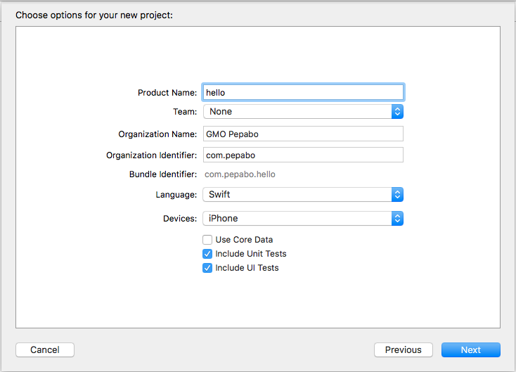
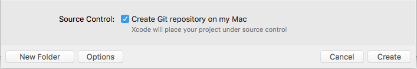
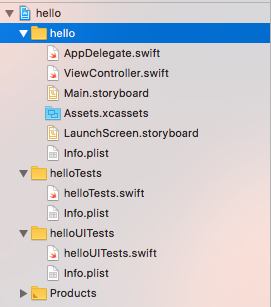
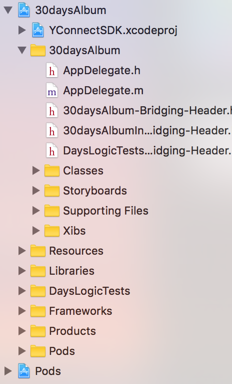
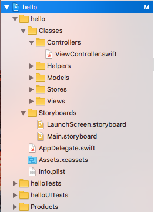
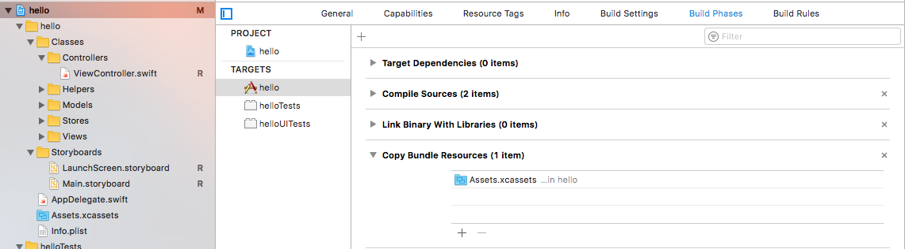
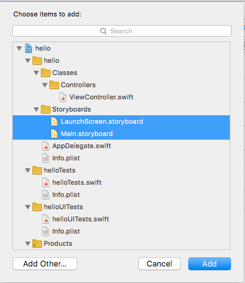

# プロジェクトの準備

ここでは、XcodeでiPhoneアプリのプロジェクトをつくり、開発に入って行くまでの手順について説明します。

## プロジェクトの作成

Xcodeを起動し、"Create a new Xcode Project"を選択します。いくつかテンプレートが表示されますが、この研修では、iOS > ApplicationにあるSingle View Applicaitonを使います。



Organization Nameは「GMO Pepabo」などにします。Organization Identifierは、組織毎に世界でユニークな文字列にする必要があります。このような文字列には、ドメインを反転させたもの（リバースドメイン）を使うことが慣例となっているので、ここでも「com.pepabo」に設定します。Core Dataは、アプリ内でデータをローカルに永続化したい際に利用するデータベースのようなものです。ここでは使用しません。



次へ進み、プロジェクトをどこに保存するかを指定します。Git管理するか選択できるので、チェックを入れておきます。ここまでで空のプロジェクトが作成できました。

## gitignoreの追加

XcodeはGitリポジトリを作ってくれますが、`.gitignore`は生成してくれません。今回は[github/gitignore](https://github.com/github/gitignore)の[Swift.gitignore](https://github.com/github/gitignore/blob/master/Swift.gitignore)を利用します。

## プロジェクト構成の変更

プロジェクトを作った直後は、各ファイルが以下の様に並んでいます。



ViewControllerとStoryboardが同じ場所にあるなど、このままファイルが増えていくと見通しが悪くなることが予想されます。そのため、例えば30days AlbumのiOSアプリでは、以下のように階層構造をつくっています。



ディレクトリのように見えますが、これらはグループと呼ばれるもので、実際のディレクトリ構造とは一致していません。このままでも開発に直接の影響はありませんが、ここでは両者をある程度揃えておきます。始めに実ディレクトリをつくり、それをXcodeへドラッグ & ドロップします。ディレクトリ構成は、[iOS Good PracticesのProject Structure](https://github.com/futurice/ios-good-practices#project-structure)を参考にします。

```console
$ ls
hello           hello.xcodeproj helloTests      helloUITests
$ mkdir -p hello/Classes/{Models,Views,Controllers,Stores,Helpers} hello/Storyboards
$ open ./hello
```

`Classes`と`Storyboards`をドラッグし、Xcodeのサイドバーにある`hello`グループ下にドロップします。"Create groups"にチェックを入れてグループを作ります。


実ファイルを、さきほど作成したディレクトリの下に動かします。

```console
$ mv hello/Base.lproj/*.storyboard hello/Storyboards
$ mv hello/ViewController.swift hello/Classes/Controllers
$ rmdir hello/Base.lproj
```

移動させたことでXcode上では実ファイルへの参照が失われているので、これら3ファイルをXcode上で一度削除します。削除した後、実ファイルをFinderからドラッグ & ドロップします。



次に、ファイルパスを正しく設定します。
`View.swift`を選択し、右のUtilitiesのLocationを`Relative to Group`に設定し、ディレクトリアイコンからファイルの参照先を指定します。
`LaunchScreen.storyboard`と`Main.storyboard`も同様に設定してください。


パスの指定が完了したら、`hello`を選択し、`Build Phases`から`Copy Bundle Resources`を選択し`+`を押します。



以下の画像のように、ストーリーボードを選択し`Add`を追加します



これによって、ディレクトリ構造とグループ階層が一致した上で、ファイルが正しく参照されるようになります。

⌘+Rでビルドが成功することを確認してください。
ここまで完了したら、コミットをしましょう。
