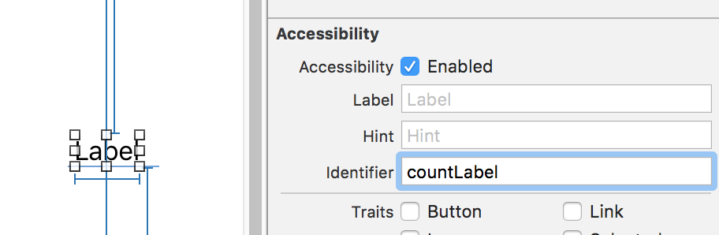

# カウンターアプリのテスト

## モデルの単体テスト

`Counter`クラスの単体テストを行います。ここでは、`countUp`メソッドで値が増えていくことと、初期値が0であることをテストします。`<プロジェクト名>Tests`グループ内に生成されている、[`XCTestCase`](https://developer.apple.com/reference/xctest/xctestcase)を継承したクラスを編集します。

```swift
import XCTest
@testable import hello

class helloTests: XCTestCase {

    var counter = Counter()

    override func setUp() {
        super.setUp()

        self.counter = Counter()
    }

    override func tearDown() {
        super.tearDown()
    }

    func testCountUp() {
        self.counter.countUp()
        XCTAssertEqual(1, self.counter.current())

        self.counter.countUp()
        XCTAssertEqual(2, self.counter.current())
    }

    func testInitialCount() {
        XCTAssertEqual(0, self.counter.current())
    }
}
```

`setup`と`tearDown`はそれぞれ各テストメソッドの前後に走ります。テストメソッドには命名規則があり、`testCountUp`のように`test`から始まる必要があります。ここではAssertionに`XCTAssertEqual`しか使っていませんが、他にも`XCTAssertLessThan`や`XCTAssertThrowsError`などがあります。Assertionメソッドの一覧は[Appleのドキュメント](https://developer.apple.com/library/mac/documentation/DeveloperTools/Conceptual/testing_with_xcode/chapters/04-writing_tests.html#//apple_ref/doc/uid/TP40014132-CH4-SW35)を参照してください。テストを走らせるには、テストクラス定義の左にある再生ボタンを使うか、Ctrl+Alt+⌘+Uを使用します。

## UIテスト

アプリケーションに特定の操作を行ったときの画面上の表示を確認するために、[`XCUIApplication`](https://developer.apple.com/reference/xctest/xcuiapplication)クラスを使用してUIテストを書きます。単体テストと同じく`XCTestCase`を継承しているため、`setUp`や`tearDown`が利用できます。

```swift
import XCTest

class helloUITests: XCTestCase {

    override func setUp() {
        super.setUp()

        continueAfterFailure = false
        XCUIApplication().launch()
    }

    override func tearDown() {
        super.tearDown()
    }

    func testCounting() {
        let app = XCUIApplication()
        let countButton = app.buttons["増える"]
        let countLabel  = app.staticTexts["countLabel"]

        XCTAssertEqual("0", countLabel.label)

        countButton.tap()

        XCTAssertEqual("1", countLabel.label)
    }
}
```

`XCUIApplication`をインスタンス化し、それを経由することで画面上の要素を取得できます。要素を指定するには、`buttons["増える"]`のように要素上のラベルを直接指定する方法と、accessibility identifierで指定する方法があります。accessibility identifierは、ViewControllerで

```swift
self.countLabel.accessibilityIdentifier = "countLabel"
```

として設定するか、Storyboard上で下図のように設定します。



ここではUI要素の取得に`buttons`と`staticTexts`を使用しましたが、他にも同様のメソッドが用意されています。詳細は[XCUIElementTypeQueryProvider](https://developer.apple.com/reference/xctest/xcuielementtypequeryprovider)プロトコルのドキュメントを参照してください。
テストを走らせるには、単体テストと同様に、テストクラス定義の左にある再生ボタンを使うか、Ctrl+Alt+⌘+Uを使用します。シミュレータ上でテスト結果が安定しない場合は[実機との接続](./actual-device.md)を参照の上、実機でUIテストを行ってください。
