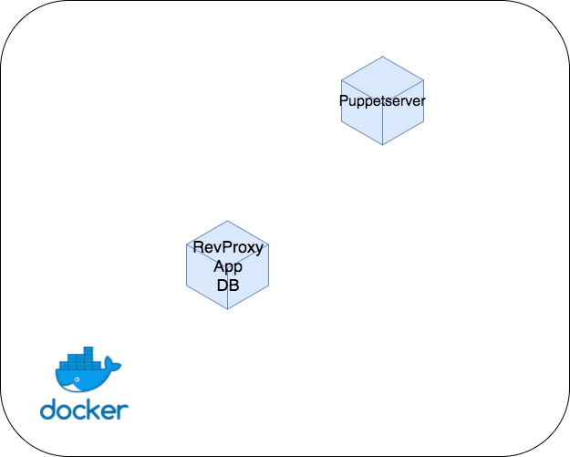
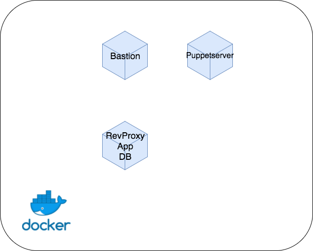

# Puppetserverと踏み台サーバ

## Puppetserverについて

[Puppetについて](puppet.md)に書いてあるように、今回の研修ではAgent/Masterモードを使って、manifest の適用を行います。
[asuforce/puppetserver](https://hub.docker.com/r/asuforce/puppetserver/)のイメージは使わずに1から構築を行なってください。

### ポイント

Puppet masterと言われる、Puppetserverの前身が存在しますが、JVM上で動く[Puppetserver](https://docs.puppet.com/puppetserver/latest/services_master_puppetserver.html)を使って構築してください。

## 踏み台サーバについて

マニフェストの適用や障害時の対応のため、各サーバにsshログインできるようにします。しかしながら、[注意書き](../README.md#グローバルIPの節約)にも書いたように、全てのサーバにグローバルIPを与えることは現実的ではありません。解決策の1つとして、グローバルIPを持った踏み台サーバを用意し、そこからsshできるように設定します。

## 手順

Puppetserverを構築してから、踏み台サーバを構築しましょう。
[全部載せコンテナ](all_in_one.md)のときと同様に、以下の順に作業してください。マニュアルインストールは、必要なければスキップして結構です。

1. マニュアルインストール
1. テストの作成
1. マニフェストの作成
