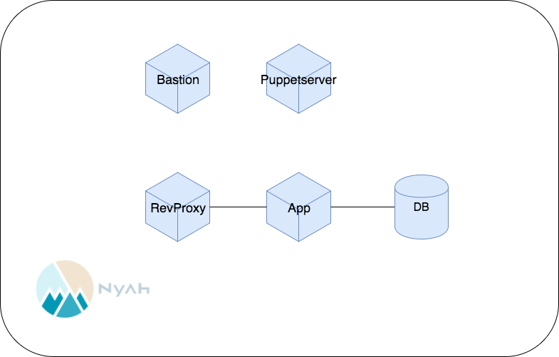

# ロール毎のホストの分離

全部載せコンテナを、Reverse Proxy、App、DBの3台に分離します。ペパボでは、複数のホストが同じロールを担うとき、ホスト名に`app001`のようにゼロ詰めした3桁の通し番号を付ける慣習があります。DB, Appは複数作成するため、それぞれ`001`を付けておきましょう。
また現在では、`<role>-<ipaddr>.domain.jp`のような形が採用されることも多くなってきました。

## 手順

### テストとマニフェストの追加

[全部載せコンテナ](all_in_one.md)のときに適切にロール分割ができていれば、個別のコンテナにマニフェストを適用すればこのステップはほぼ終了ですが、そう上手くは行かないと思います。不足しているマニフェストとテストがあると思われますので、それらを追加してください。また、必要に応じてRailsアプリの設定にも変更を加えてください。

### Nyahへ

ここまでの構成で、一度Nyahの上で動作させてみましょう。後に台数を増やして作りなおすことになるため無駄な作業のように思えますが、DockerコンテナとNyahのインスタンスではいくつか異なる部分がありますので、早いうちにその違いを把握することが目的です。研修用にテナントを用意してもらう予定ですので、ここにインスタンスをつくってください。インスタンスのサイズは、m1.smallから始めてください。

### ポイント

この章ではDockerが自動で行なっていた事を自分たちで定義する必要が出てきます。各ホストの接続や、デーモンの起動などが該当します。
ヒントとなる単語を列挙しますので、参考に調べてみてください。

- Unix domain socket, TCP/IP
- Systemd
