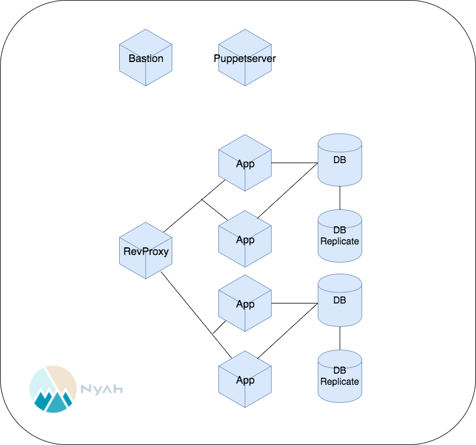

# 冗長構成

今の構成ではApp、DBはそれぞれ1台ずつですが、高可用性及び耐障害性を持ったシステムとするために、もう1台ずつ増やして冗長構成とします。最初にAppを2台とし、次にDBをMaster/Slave構成とします。

## 高可用構成と耐障害構成

高可用性とは、システムに障害が発生した場合、最小限のサービス中断が発生します。
対して耐障害性とは、障害が発生してもサービスの提供が断たれない代わりにコストが高可用構成より高くなります。

### Appを耐障害構成にする

Appサーバを追加し2台にします。RevProxyからのアクセスを2台に分散させた構成になります。
この構成は、片方のAppサーバに障害が発生しても、サービスの提供は行えるので耐障害構成になります。

#### テストとマニフェストの追加

Railsアプリを2台に増やした構成をPuppetマニフェストに記述してください。いくつかテストするべき項目が増えると思われますので、必要なテストを追加してください。Railsアプリの動作が確認できたら、片方を終了させてもサービスが停止しないことを確かめてください。

### DBを高可用構成にする

DBのSlave機能を利用し、Slaveサーバを作成します。このSlaveサーバは参照対象ではないので、この構成は高可用構成になります。

#### テストとマニフェストの追加

Master/Slave構成にするために必要な操作を洗い出し、マニフェスト化してください。それに伴って必要なテストを追加し、コンテナにマニフェストを適用してください。なお、この工程では、マニフェストに落とし込むことが難しいコマンド操作が多くなると思われます。全てがコードで表現され、自動化されていることが望ましいですが、実際のサービスのライフサイクルを考えれば頻繁にMaster/Slave構成を組むことはありませんので、ある程度の手作業は許容されます。

### Nyahへ

最終的な9台の構成で、Nyah上で動作させてください。
