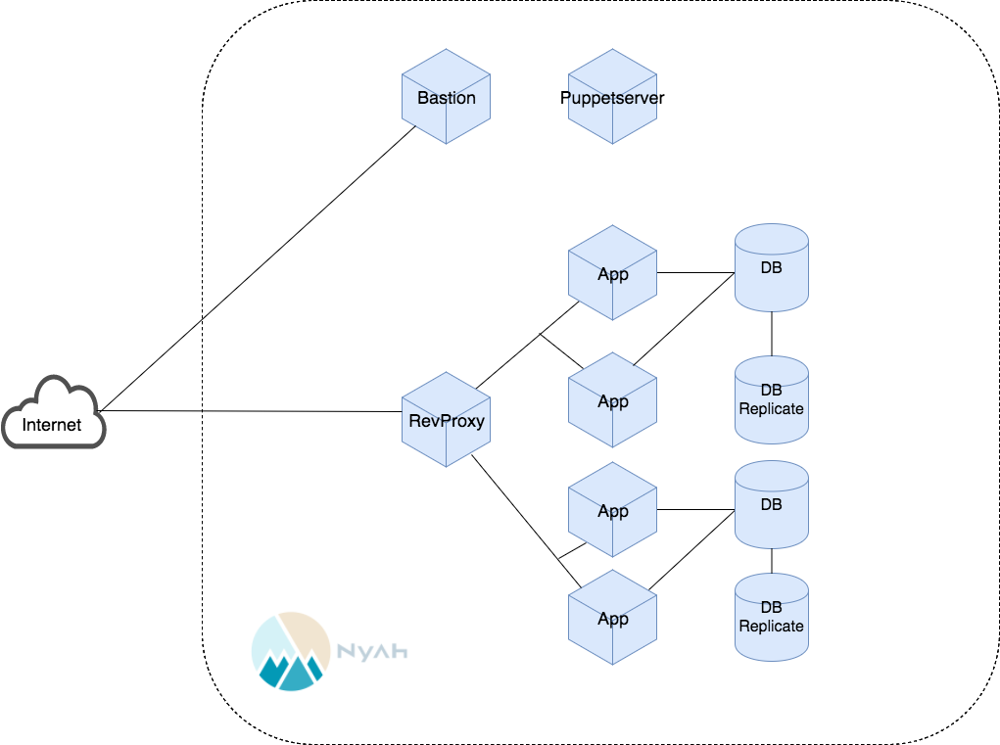

# 目指す構成

この研修では、上図構成のシステムをつくっていきます。

ユーザからのリクエストは最初にリバースプロキシで受け、後ろ側のアプリケーションサーバ（Web開発研修でつくったRailsアプリ）に振り分けます。データベースはアプリケーションサーバとは別のホストに分離し、Master/Slave構成でレプリケーションします。デプロイや障害対応などの際に各ホストへssh接続できるように踏み台サーバも用意します。踏み台サーバは、社内ではBastionという名前がつけられることが多いので、今回もそれに従いましょう。

なお、DBやリバースプロキシなど、システム上の役割のことをロールと呼びます。1台のホストが1つのロールを持つことが好ましいとされていますが、場合によっては複数のロールが1台に同居することがあります。

## 冗長化

システムの一部に障害が発生しても、全体として稼働できるように予備装置を平常時から準備し運用しておくことを冗長化、そのような構成を冗長構成と呼びます。

上の図では、AppとDBをそれぞれ2台ずつ用意することで、耐障害性を高めています。ただし、冗長化の方法は今回のやり方だけではありません。世界各地にサーバを配置して障害時はDNSの仕組みを利用して切り替える方法や、複数のMaster DBを並べる方法も存在します。この研修ではMaster/Slaveと呼ばれる構成をとりますが、これ以外の選択肢もあることは覚えておいてください。

また、複数台を配置することの利点は故障に強くなることだけではありません。必ずとは言えませんが、一般的に、Appを増やせばより多くの負荷に耐えられますし、同程度のアクセス状況でも1台のときよりレスポンスタイムは短くできるでしょう。他にもどのような恩恵があるか、話し合ってみてください。

## リバースプロキシとロードバランサ

リバースプロキシとロードバランサは、システム上の役割が似ているために混同されることがあります。ここでは両者の違いを述べます。

### リバースプロキシ

リバースプロキシはクライアントからのリクエストを受け付け、URIに応じてシステム内のサーバにそれらを振り分けます。振り分けられたサーバからのレスポンスはリバースプロキシを介してクライアントへ送られるため、リバースプロキシはレスポンスをgzip圧縮するなどの工夫を行うことできます。レスポンスの内容をキャッシュしておき、次回以降はリバースプロキシがそれを返すことや、SSL通信の終端をリバースプロキシにすることも可能です。これにより、レスポンスタイムの改善やバックエンドのサーバ群の負荷が軽減されることが期待できます。

### ロードバランサ

ロードバランサは、負荷分散を目的としたネットワーク機器です。外部からのリクエストを、同等の機能を持つ複数のサーバに振り分けます。これにより、横方向へのスケールが容易となります。どのサーバに振り分けるかを決める方式としては、単に順番に振る方法や、処理しているコネクションの数が少ないサーバに振る方法などがあります。障害などにより動作していないサーバへ振り分けてしまうことを防ぐため、定期的にヘルスチェックを行うこともあります。

### リバースプロキシとロードバランサの違い

通信レイヤの違いとして、基本的にリバースプロキシはL7（アプリケーション層）、ロードバランサはL4（トランスポート層）という違いがあります。L4までの情報によって振り分けを行う場合は、IPアドレスやポート番号に基いて振り分けが行われます。一方でL7の場合は、HTTPヘッダの内容などを振り分けの判定に用いることが可能です。ただし現在では、ほとんどのロードバランサがL7をサポートしているため、通信レイヤにおける両者の違いは少なくなってきています。

またリバースプロキシは、圧縮など通信内容に手を加えることや、自身がキャッシュや静的コンテンツを読んでレスポンスを返すことがありますが、ロードバランサはそのようなことは行いません。
