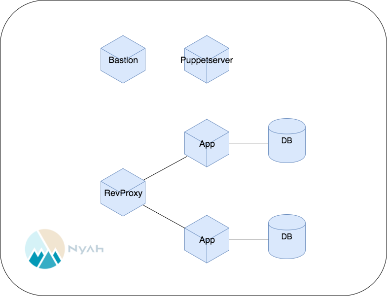

# バーチャルホスト

モバイル研修では、2チームで別々のiOSアプリケーションを開発してもらいます。
通常そのためには、２つのインフラの構築が必要になりますが、今回のWebオペレーション研修ではインフラを１つしか組んでいないので、バーチャルホストを利用して２つのアプリケーションをホスティングできるようにします。

## 手順

[ロール毎のホストの分離](dividing_into_roles.md)で分離した、App, DB を増やして別のRailsアプリケーションをデプロイできるようにしてください。これまでに作成した設定ファイルをうまく使いましょう。
